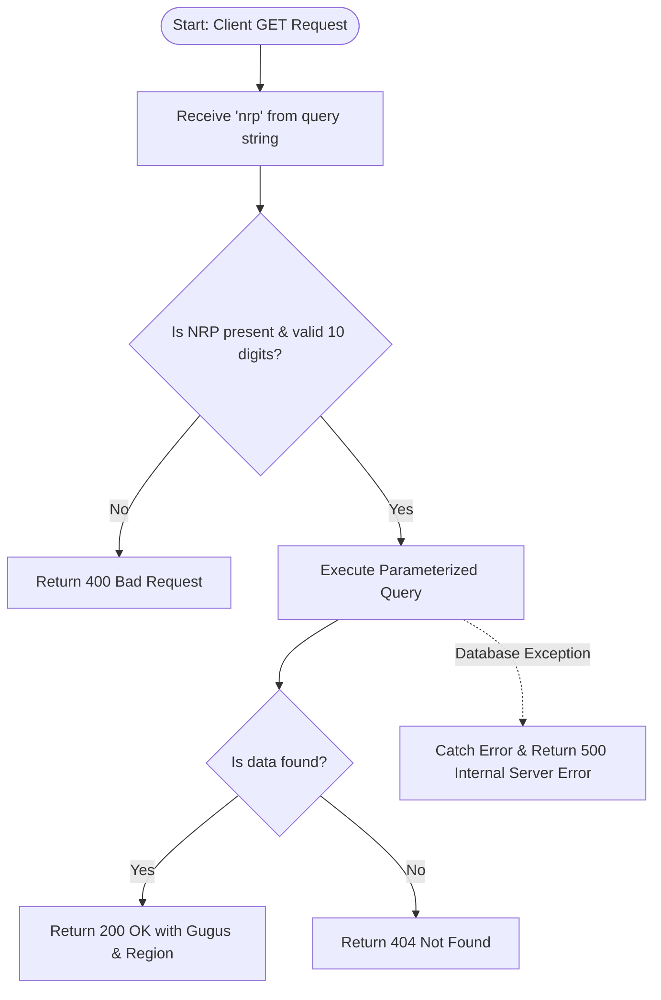

# Penugasan-A-GEREX2026-Naila-Saada-Cahyani
This is the required task for GEREX 2026 Open Recruitment in Website Development division, mainly FE/BE position.
Repositori ini berisi rancangan dan implementasi fitur **Gugus Checker** untuk memenuhi penugasan Web Development (A) GERIGI X UKM EXPO ITS 2026. 
---
## 1. Rancangan Tabel Database (ERD) 

Berikut adalah struktur *Entity Relationship Diagram* (ERD) untuk tabel utama `mahasiswa_baru`. 

 ```mermaid
 erDiagram 
MAHASISWA_BARU { string id PK "UUID / INT (Auto Increment)" 
string nrp UK "Unique & Indexed"
string nama "VARCHAR" 
string fakultas "VARCHAR" 
string departemen "VARCHAR" 
string gugus "VARCHAR" 
string region "VARCHAR" 
string no_telp "VARCHAR" }
 ```
 _Catatan :_ Meskipun tabel database menyimpan data lengkap termasuk data akademik dan kontak `no_telp`, endpoint API publik (GET) dirancang secara ketat untuk **hanya** mengembalikan data `gugus` and `region`. Hal ini untuk mencegah kebocoran informasi pribadi (PII - _Personally Identifiable Information_).

## 2. Alur Endpoint API & Workflow
Fitur ini menggunakan arsitektur RESTful dengan metode HTTP **GET** untuk mengambil data berdasarkan parameter NRP dari _query string_.

**Endpoint:** `GET /api/gugus-checker?nrp=[input_nrp]`

### Diagram Alur




## 3. Implementasi Kode (TypeScript & Next.js App Router)

Kode *endpoint* dipecah menjadi beberapa bagian utama berdasarkan fungsionalitasnya untuk memudahkan pembacaan dan *maintenance*.

### A. Setup & Import Modul
Mengimpor fungsi bawaan Next.js untuk menangani *request/response* dan memanggil *instance* database *client*.
```typescript
import { NextRequest, NextResponse } from 'next/server';
// Mocking the project's built-in database client (e.g., Prisma or pg pool)
import { db } from '@/lib/db';
```

### B. Ekstraksi Parameter & Validasi
Sistem mengambil nilai `nrp` dari URL lalu memverifikasi bahwa parameter tersebut terisi dan sesuai dengan format NRP (10 digit angka).
```TypeScript
export async function GET(request: NextRequest) {
  // 1. Get the 'nrp' parameter from the query string (?nrp=...)
  const { searchParams } = new URL(request.url);
  const nrp = searchParams.get('nrp');

  // Check Is the nrp parameter present?
  if (!nrp) {
    return NextResponse.json(
      { success: false, message: 'NRP is required' }, 
      { status: 400 }
    );
  }

  // Ensure the NRP format is a 10-digit number
  const isNumeric = /^\d+$/.test(nrp);
  if (nrp.length !== 10 || !isNumeric) {
    return NextResponse.json(
      { success: false, message: 'Invalid NRP format, it must be a 10-digit number' }, 
      { status: 400 }
    );
  }
```

### C. Eksekusi Query Database  
Sistem mencari data mahasiswa baru berdasarkan `nrp` yang telah divalidasi. Nilai `nrp` diteruskan sebagai parameter query sehingga proses pencarian dapat dilakukan secara aman dan rapi sebelum hasilnya dikembalikan ke aplikasi.
```TypeScript
try {
    // Securely query the database ($1 automatically sanitizes the input)
    const query = 'SELECT gugus, region FROM mahasiswa_baru WHERE nrp = $1';
    const result = await db.query(query, [nrp]);
```

### D. **Penanganan Response**  
Hasil query yang diterima dari database kemudian diproses untuk menentukan respons yang akan dikirim. Jika data mahasiswa baru tersedia, API mengembalikan status keberhasilan disertai data `gugus` dan `region`. Jika data tidak ditemukan, API mengembalikan status yang menunjukkan bahwa pencarian tidak menghasilkan data yang sesuai.
```TypeScript
// Check if the student data is found
    if (result.rowCount > 0) {
      const dataMaba = result.rows[0];
      
      // Returning only necessary data to protect user privacy
      return NextResponse.json(
        {
          success: true,
          data: {
            nrp: nrp,
            gugus: dataMaba.gugus,
            region: dataMaba.region
          }
        },
        { status: 200 }
      );
    } else {
      // If the NRP is not registered in the database
      return NextResponse.json(
        { success: false, message: 'NRP not found or not registered' },
        { status: 404 }
      );
    }
```

### E. **Penanganan Error Server**  
Selama proses berlangsung, sistem mengantisipasi kemungkinan terjadinya kesalahan eksekusi. Ketika error terdeteksi, proses penanganan akan dijalankan untuk menghasilkan respons yang sesuai sehingga client tetap memperoleh informasi mengenai kegagalan yang terjadi.
```TypeScript
} catch (error) {
    // Handle internal bugs if the database goes down or throws an error
    console.error('Database runtime error on Gugus Checker:', error);
    
    return NextResponse.json(
      { success: false, message: 'An internal server error occurred' },
      { status: 500 }
    );
  }
}
```

